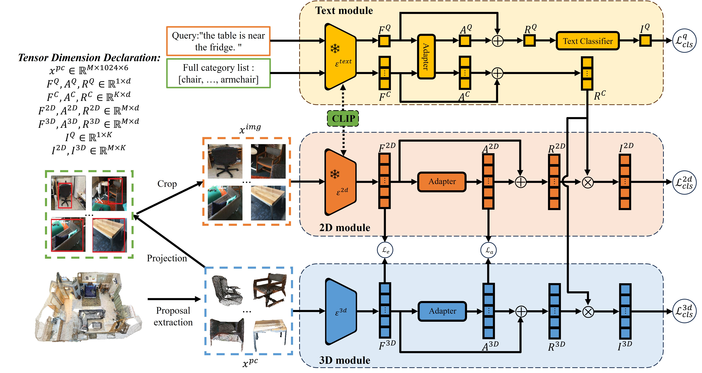

# Weakly-Supervised 3D Visual Grounding based on Visual Language Alignment
This repository is the offical implementation of our paper Weakly-Supervised 3D Visual Grounding based on Visual Language Alignment.

[[Arkiv]](https://arxiv.org/abs/2312.09625)

## Abstract
Learning to ground natural language queries to target objects or regions in 3D point clouds is quite essential for 3D scene understanding. Nevertheless, existing 3D visual grounding approaches require a substantial number of bounding box annotations for text queries, which is time-consuming and labor-intensive to obtain. In this paper, we propose 3D-VLA, a weakly supervised approach for 3D visual grounding based on Visual Language Alignment. Our 3D-VLA exploits the superior ability of current large-scale vision-language models (VLMs) on aligning the semantics between texts and 2D images, as well as the naturally existing correspondences between 2D images and 3D point clouds, and thus implicitly constructs correspondences between texts and 3D point clouds with no need for fine-grained box annotations in the training procedure. During the inference stage, the learned text-3D correspondence will help us ground the text queries to the 3D target objects even without 2D images. To the best of our knowledge, this is the first work to investigate 3D visual grounding in a weakly supervised manner by involving large scale vision-language models, and extensive experiments on ReferIt3D and ScanRefer datasets demonstrate that our 3D-VLA achieves comparable and even superior results over the fully supervised methods.



## Installation and Data Preparation
Please refer the installation and data preparation from [referit3d](https://github.com/referit3d/referit3d).

We adopt bert-base-uncased from huggingface, which can be installed using pip as follows:
```Console
pip install transformers
```
you can download the pretrained weight in [this page](https://huggingface.co/bert-base-uncased/tree/main), and put them into a folder, noted as PATH_OF_BERT.


## 2D image Preparation
To obtain the 2D projected image, you can process like:
```
python referit3d/data_process/generate_2d_referit3d.py --log-dir referit3d/data_process/logs/nr3d
```
here you need to change the path in the generate_2d_referit3d.py.


## Training
* To train on either Nr3d or Sr3d dataset, use the following commands
```Console
    python referit3d/scripts/train_referit3d.py --log-dir logs/3d_vla_nr3d 
```

* To train nr3d in joint with sr3d, add the following argument
```Console
    --augment-with-sr3d sr3d_dataset_file.csv
``` 

## Validation
* After each epoch of the training, the program will automatically evaluate the performance of the current model. Our code will save the last model in the training as **last_model.pth**, and save the best model following the original Referit3D's repo as **best_model.pth**.


## Test
* At test time, the **analyze_predictions** will run following the original code of Referit3D. 
* The **analyze_predictions** will test the model multiple times, each time using a different random seed. With different random seeds, the sampled point clouds of each object are different. The average accuracy and std will be reported. 

* To test on either Nr3d or Sr3d dataset, use the following commands
```Console
    python referit3d/scripts/train_referit3d.py --mode evaluate --resume-path your_best_model_path --log-dir eval_logs/nr3
```


## Citation
```
@article{xu2023weakly,
  title={Weakly-supervised 3D visual grounding based on visual linguistic alignment},
  author={Xu, Xiaoxu and Yuan, Yitian and Zhang, Qiudan and Wu, Wenhui and Jie, Zequn and Ma, Lin and Wang, Xu},
  journal={arXiv preprint arXiv:2312.09625},
  year={2023}
}
```

## Credits
The project is built based on the following repository:
* [ReferIt3D](https://github.com/referit3d/referit3d) and [MVT](https://github.com/sega-hsj/MVT-3DVG).
